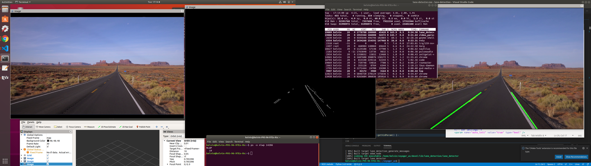

# Lane Detection
By Kelvin Kang

This is a lane detection with OpenCV canny edge and hough transform with ros wrapper

## System Dependencies
* Ubuntu 18.04.4 LTS
* ROS Kinetic / Melodic
* cmake >= 2.8.3
* OpenCV >= 4.1

## Setup
1. Clone this repo under your workspace `~/catkin_ws/src`

2. Install ros dependencies under ~/catkin_ws 

   `rosdep install --from-paths src --ignore-src --rosdistro=${ROS_DISTRO} -y`

3. Install OpenCV

   https://www.learnopencv.com/install-opencv-4-on-ubuntu-18-04/

4. Go to ~/catkin_ws and run `catkin_make`

5. Edit launch file to select the video file of your input

6. Run the launch file `roslaunch lane_detection lane_detection.launch`

## Details

There's two nodes inside this package:

1. video-parser

   This node takes in an input video (e.g. .mp4 files) or video camera access that is connected to your computer and convert it to `sensor_msgs::Image` ros topic

2. lane-detector

   This node takes an input `sensor_msgs::Image` topic and output another `sensor_msgs::Image` topic with the lane lines overlaid on the original image